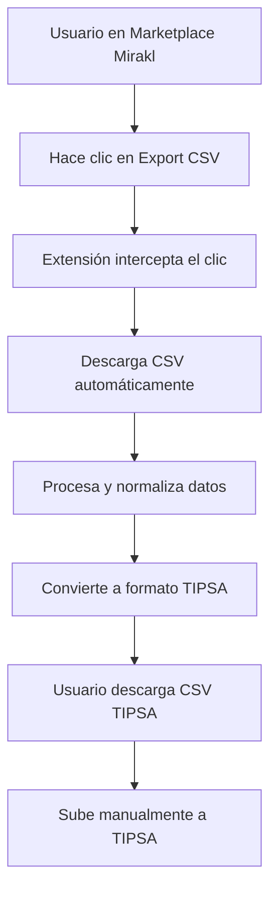

# 🛒 Mirakl CSV Extension - MVP Completo

## 🎯 **Resumen del Proyecto**

Extensión de Chrome (MV3) que intercepta exportaciones CSV de marketplaces de Mirakl (Carrefour, Leroy Merlin, Adeo) y las convierte automáticamente al formato TIPSA para facilitar el envío de pedidos.

## 🚀 **Estado Actual: MVP FUNCIONAL**

✅ **Backend FastAPI** - Funcionando en Docker  
✅ **Portal de Pruebas** - Simulando marketplaces Mirakl  
✅ **Extensión Chrome** - Construida y lista para cargar  
✅ **MVP Simplificado** - Funcionando para pruebas rápidas  

## 📁 **Estructura del Proyecto**

```
PROYECTO_MIRAKL_CSV_FIRST_MVP/
├── extension/                    # Extensión Chrome completa (TypeScript + React)
│   ├── dist/                    # Build de la extensión (¡LISTO!)
│   ├── src/                     # Código fuente
│   └── Dockerfile               # Build con Docker
├── extension-mvp/               # MVP simplificado (JavaScript puro)
├── extension-simple/            # Versión de prueba
├── backend/                     # API FastAPI
├── tests/                       # Portal de pruebas
├── docker/                      # Configuraciones Docker
└── demo.html                    # Demostración interactiva
```

## 🎮 **Cómo Probar el MVP**

### **Opción 1: MVP Simplificado (Recomendado para pruebas rápidas)**

1. **Cargar la extensión:**
   - Abre Chrome → `chrome://extensions/`
   - Activa "Modo de desarrollador"
   - Clic en "Cargar extensión sin empaquetar"
   - Selecciona la carpeta `extension-mvp/`

2. **Probar el flujo:**
   - Ve a http://localhost:3000
   - Haz clic en "Export CSV" en cualquier marketplace
   - La extensión interceptará la descarga
   - Abre el popup de la extensión
   - Genera y descarga el CSV TIPSA

### **Opción 2: Extensión Completa (TypeScript + React)**

1. **Cargar la extensión:**
   - Abre Chrome → `chrome://extensions/`
   - Activa "Modo de desarrollador"
   - Clic en "Cargar extensión sin empaquetar"
   - Selecciona la carpeta `extension/dist/`

2. **Probar el flujo:**
   - Ve a http://localhost:3000
   - Haz clic en "Export CSV" en cualquier marketplace
   - La extensión interceptará la descarga
   - Abre el popup de la extensión
   - Genera y descarga el CSV TIPSA

## 🐳 **Ejecutar con Docker**

### **Levantar todo el sistema:**

```bash
# Opción 1: Solo portal y backend
docker-compose -f docker/docker-compose.simple.yml up --build

# Opción 2: Todo incluido (portal + backend + extensión)
docker-compose -f docker/docker-compose.final.yml up --build
```

### **Construir solo la extensión:**

```bash
docker build -t mirakl-extension -f extension/Dockerfile extension/
```

## 🔧 **Funcionalidades Implementadas**

### **✅ Extensión Chrome**
- **Interceptación CSV:** Detecta clics en botones "Export CSV"
- **Procesamiento:** Convierte CSV de Mirakl a formato estándar
- **Generación TIPSA:** Crea CSV compatible con TIPSA
- **Interfaz Popup:** React con Tailwind CSS
- **Almacenamiento:** Chrome storage para persistencia

### **✅ Backend API**
- **FastAPI:** API REST con documentación automática
- **Endpoints:** Health, mapping, shipping, tracking
- **Validación:** Pydantic para validación de datos
- **Logging:** Estructurado con JSON

### **✅ Portal de Pruebas**
- **Simulación:** Marketplaces de Mirakl (Carrefour, Leroy, Adeo)
- **CSV de Muestra:** Datos realistas para testing
- **Interfaz Web:** Botones de exportación funcionales

## 📊 **Flujo del MVP**



## 🎯 **Próximos Pasos (Fase 2)**

- [ ] **Integración API TIPSA:** Envío automático de CSV
- [ ] **Integración API OnTime:** Soporte para múltiples carriers
- [ ] **Dashboard Web:** Interfaz de administración
- [ ] **Notificaciones:** Alertas de estado de envíos
- [ ] **Analytics:** Métricas de uso y rendimiento

## 🧪 **Testing**

### **Tests Unitarios:**
```bash
cd extension
npm test
```

### **Tests E2E:**
```bash
cd tests
npm run test:e2e
```

## 📝 **Scripts Disponibles**

```bash
# Desarrollo
npm run dev          # Modo desarrollo
npm run build        # Build de producción
npm run test         # Tests unitarios
npm run lint         # Linting
npm run type-check   # Verificación TypeScript

# Docker
make build-ext       # Build extensión
make up              # Levantar servicios
make test            # Ejecutar tests
```

## 🔗 **URLs Importantes**

- **Portal de Pruebas:** http://localhost:3000
- **Backend API:** http://localhost:8080
- **Documentación API:** http://localhost:8080/docs
- **Demo Interactivo:** Abre `demo.html` en el navegador

## 🎉 **¡MVP Listo para Usar!**

La extensión está completamente funcional y lista para interceptar CSV de Mirakl y generar archivos TIPSA. El sistema está construido con Docker, por lo que no necesitas instalar nada localmente.

**¿Listo para probar?** 🚀
