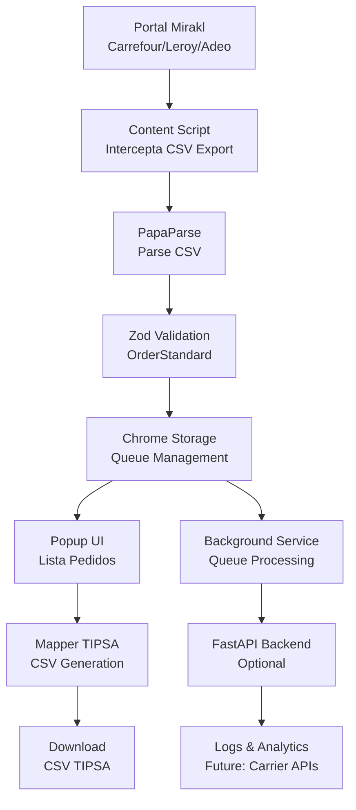

# Arquitectura del Sistema - Mirakl CSV Extension

## 🏗️ Visión General

El sistema implementa un flujo CSV-first para interceptar exportaciones de marketplaces Mirakl, normalizar los datos y generar archivos compatibles con transportistas (TIPSA/OnTime).

## 📊 Diagrama de Flujo



## 🧩 Componentes Principales

### 1. Chrome Extension (MV3)

#### Content Scripts
- **`content/hookExport.ts`**: Intercepta clicks en botones/enlaces "Export CSV"
- **`content/injectButton.ts`**: Botón flotante opcional "Exportar & Enviar (CSV)"

#### Background Service Worker
- **`background/index.ts`**: Gestión de cola en `chrome.storage`
- Mensajes: `GET_QUEUE`, `ENQUEUE`, `CLEAR`

#### Popup Interface
- **`popup/App.tsx`**: Lista de pedidos + botón "Generar CSV TIPSA"
- **`popup/components/`**: Componentes React reutilizables

#### Core Libraries
- **`lib/csv.ts`**: Parse/build de archivos CSV
- **`lib/storage.ts`**: Ofuscación ligera de datos sensibles
- **`lib/queue.ts`**: Gestión de cola de pedidos

#### Mappers
- **`mappers/tipsa.ts`**: Conversión OrderStandard → CSV TIPSA
- **`mappers/ontime.ts`**: Placeholder para futuro mapper OnTime

### 2. Backend FastAPI (Opcional en MVP)

#### API Endpoints (Active)
- `GET /api/v1/health/` → Basic health check
- `GET /api/v1/health/detailed` → Detailed health status
- `POST /api/v1/orchestrator/fetch-orders` → Fetch orders from Mirakl
- `POST /api/v1/orchestrator/post-to-carrier` → Send orders to carrier
- `POST /api/v1/orchestrator/push-tracking-to-mirakl` → Update tracking in Mirakl
- `POST /api/v1/carriers/{carrier}/shipments` → Create carrier shipments
- `GET /api/v1/logs/operations` → Get operations logs
- `GET /api/v1/logs/exports/operations.csv` → Export operations CSV

**Note:** Client-side mapping (OrderStandard → CSV TIPSA) is handled in the browser extension, not via backend API.

#### Core Services
- **`app/core/settings.py`**: Configuración con Pydantic Settings
- **`app/core/logging.py`**: Logging estructurado JSON
- **`app/models/order.py`**: Modelos Pydantic (OrderStandard, OrderItem)
- **`app/services/tipsa.py`**: Lógica de mapeo TIPSA

### 3. Testing Infrastructure

#### E2E Tests (Playwright)
- Portal fake con botón "Export CSV"
- Fixtures de CSV realistas (Carrefour, Leroy)
- Flujo completo: intercept → parse → popup → generate

#### Unit Tests
- Parsers CSV con casos edge
- Validadores Zod con datos inválidos
- Mappers TIPSA con validación de cabeceras

## 🔄 Flujo de Datos

### 1. Interceptación CSV
```typescript
// Content script detecta click en export
const exportButton = document.querySelector('[data-export-csv]');
exportButton?.addEventListener('click', async (e) => {
  e.preventDefault();
  const csvUrl = extractCsvUrl(exportButton);
  const csvData = await fetchWithCookies(csvUrl);
  // Enviar a background para procesamiento
});
```

### 2. Normalización
```typescript
// Parse CSV → OrderStandard
const orders = Papa.parse(csvData, { header: true });
const validatedOrders = orders.data
  .map(parseMiraklOrder)
  .filter(order => OrderStandardSchema.safeParse(order).success);
```

### 3. Mapeo TIPSA
```typescript
// OrderStandard → CSV TIPSA
const tipsaCsv = mapOrdersToTipsaCsv(orders);
// Cabeceras: destinatario;direccion;cp;poblacion;pais;contacto;telefono;email;referencia;peso;servicio
```

## 🛡️ Seguridad y Privacidad

### PII Handling
- **Minimización**: Solo datos necesarios para envío
- **Ofuscación**: Nombres/teléfonos parcialmente ocultos en logs
- **Storage**: Datos efímeros en `chrome.storage.local`
- **Futuro**: Cifrado local en Fase 2

### Logging
- **Sin PII**: Logs estructurados sin datos personales
- **Anonimización**: IDs de pedido hasheados para tracking
- **Retención**: Logs rotativos con TTL configurable

## ⚡ Ventajas del Enfoque CSV-first

### ✅ Pros
- **Compatibilidad**: Funciona con cualquier portal Mirakl
- **Simplicidad**: No requiere APIs complejas
- **Inmediato**: Sin configuración de credenciales
- **Robusto**: Menos puntos de fallo

### ⚠️ Limitaciones
- **Manual**: Requiere intervención del usuario
- **Fragilidad**: Dependiente de estructura HTML del portal
- **Limitado**: Solo datos disponibles en CSV
- **Temporal**: Solución de transición hacia API-first

## 🚀 Plan de Migración API-first

### Fase 2: Integración Mirakl API
```typescript
// Futuro: Reemplazar interceptación CSV
const miraklClient = new MiraklClient({
  apiKey: settings.miraklApiKey,
  environment: 'production'
});

const orders = await miraklClient.getOrders({
  status: ['PENDING', 'ACCEPTED', 'SHIPPED'],
  dateFrom: lastSync
});
```

### Beneficios API-first
- **Automatización**: Sin intervención manual
- **Tiempo Real**: Sincronización continua
- **Completo**: Acceso a todos los datos del pedido
- **Robusto**: APIs estables y documentadas

## 🔧 Configuración de Desarrollo

### Variables de Entorno
```bash
# Backend
BACKEND_PORT=8080
LOG_LEVEL=INFO

# Carrier APIs (Fase 2)
TIPSATOKEN=your_tipsa_token
ONTIMETOKEN=your_ontime_token

# Development
NODE_ENV=development
PYTHONPATH=./backend
```

### Docker Services
```yaml
services:
  backend:
    build: ../backend
    ports: ["8080:8080"]
    environment:
      - LOG_LEVEL=INFO
    healthcheck:
      test: ["CMD", "curl", "-f", "http://localhost:8080/health"]
      
  extension_build:
    build: ../extension
    volumes:
      - ../extension/dist:/artifacts/dist
```

## 📈 Métricas y Monitoreo

### KPIs del Sistema
- **Tasa de Interceptación**: % de CSVs capturados exitosamente
- **Tiempo de Procesamiento**: Latencia parse → CSV TIPSA
- **Calidad de Datos**: % de pedidos válidos vs errores
- **Uso de Storage**: Tamaño de cola en `chrome.storage`

### Alertas (Fase 2)
- Fallos de interceptación > 10%
- Errores de validación > 5%
- Cola de pedidos > 100 elementos
- Backend no disponible > 5 min

## 🔮 Roadmap Técnico

### Q1 2024: MVP CSV-first
- [x] Interceptación CSV funcional
- [x] Mapper TIPSA básico
- [x] Tests E2E con portal fake
- [x] CI/CD con GitHub Actions

### Q2 2024: API Integration
- [ ] Integración Mirakl Seller API
- [ ] Mapper OnTime completo
- [ ] Dashboard de monitoreo
- [ ] Alertas y notificaciones

### Q3 2024: Production Ready
- [ ] Autenticación y autorización
- [ ] Rate limiting y throttling
- [ ] Backup y recovery
- [ ] Documentación API completa

### Q4 2024: Scale & Optimize
- [ ] Caching inteligente
- [ ] Load balancing
- [ ] Microservicios
- [ ] Observabilidad avanzada
