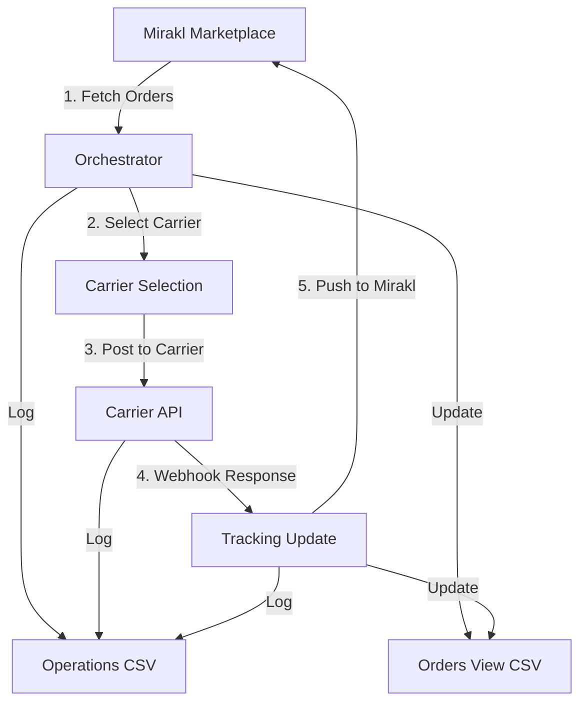

# System Flows Documentation

This document describes the main workflows and data flows in the Mirakl-TIPSA Orchestrator system.

## Overview

The system orchestrates the flow of orders from Mirakl marketplace to various carriers (TIPSA, OnTime, SEUR, etc.) and back, with comprehensive logging and state tracking.

## Main Workflow: Mirakl → Carrier → Tracking → Mirakl



## Detailed Flow Steps

### Step 1: Fetch Orders from Mirakl
**Endpoint:** `POST /api/v1/orchestrator/fetch-orders`

**Process:**
1. Call Mirakl API to get pending orders
2. For each order:
   - Log operation: `scope=mirakl, action=fetch_order`
   - Create/update entry in orders_view.csv
   - Set `internal_state=PENDING_POST`

**Data Flow:**
```
Mirakl API → Order Data → CSV Operations Logger → Orders View CSV
```

**Logging:**
- Operations CSV: `mirakl.fetch_order` entries
- Orders View CSV: New/updated order records

### Step 2: Select Carrier
**Process:**
1. Apply carrier selection rules based on:
   - Order weight
   - Destination country
   - Customer preferences
   - Carrier availability

**Carrier Selection Rules:**
- Weight < 1kg → OnTime
- Weight 1-5kg → TIPSA
- Weight > 5kg → SEUR
- International → Correos Express

### Step 3: Post Orders to Carrier
**Endpoint:** `POST /api/v1/orchestrator/post-to-carrier`

**Process:**
1. Get orders with `internal_state=PENDING_POST`
2. Transform order data to carrier format
3. Call carrier API to create shipments
4. For each successful shipment:
   - Log operation: `scope=carrier, action=create_shipment`
   - Update orders_view.csv with carrier info
   - Set `internal_state=POSTED`

**Data Flow:**
```
Orders View CSV → Carrier API → Shipment Data → CSV Operations Logger → Orders View CSV
```

**Logging:**
- Operations CSV: `carrier.create_shipment` entries
- Orders View CSV: Updated with carrier_code, tracking_number, expedition_id

### Step 4: Receive Tracking Updates
**Endpoint:** `POST /api/v1/carriers/{carrier}/webhook`

**Process:**
1. Receive webhook from carrier with tracking updates
2. Validate webhook signature and data
3. For each tracking update:
   - Log operation: `scope=carrier, action=webhook_received`
   - Update orders_view.csv with tracking info
   - Set `internal_state=AWAITING_TRACKING` or `TRACKED`

**Data Flow:**
```
Carrier Webhook → Webhook Handler → CSV Operations Logger → Orders View CSV
```

**Logging:**
- Operations CSV: `carrier.webhook_received` entries
- Orders View CSV: Updated with tracking_number, carrier_status

### Step 5: Push Tracking to Mirakl
**Endpoint:** `POST /api/v1/orchestrator/push-tracking-to-mirakl`

**Process:**
1. Get orders with `internal_state=TRACKED`
2. Transform tracking data to Mirakl format
3. Call Mirakl API to update tracking
4. For each successful update:
   - Log operation: `scope=mirakl, action=update_tracking`
   - Update orders_view.csv
   - Set `internal_state=MIRAKL_OK`

**Data Flow:**
```
Orders View CSV → Mirakl API → Update Response → CSV Operations Logger → Orders View CSV
```

**Logging:**
- Operations CSV: `mirakl.update_tracking` entries
- Orders View CSV: Updated with mirakl_tracking_updated=true

## State Transitions

### Order State Machine
```
PENDING_POST → POSTED → AWAITING_TRACKING → TRACKED → MIRAKL_OK
     ↓           ↓            ↓               ↓          ↓
FAILED_POST  FAILED_POST  FAILED_TRACKING  FAILED_PUSH  COMPLETE
```

### State Descriptions

| State | Description | Next States |
|-------|-------------|-------------|
| `PENDING_POST` | Order fetched from Mirakl, ready for carrier | `POSTED`, `FAILED_POST` |
| `POSTED` | Successfully sent to carrier | `AWAITING_TRACKING`, `FAILED_POST` |
| `AWAITING_TRACKING` | Waiting for tracking from carrier | `TRACKED`, `FAILED_TRACKING` |
| `TRACKED` | Tracking received from carrier | `MIRAKL_OK`, `FAILED_PUSH` |
| `MIRAKL_OK` | Tracking successfully pushed to Mirakl | `COMPLETE` |
| `FAILED_*` | Error states for retry | Previous state or `PENDING_POST` |

## Error Handling and Retry Logic

### Retry Strategy
1. **Exponential Backoff**: 1s, 2s, 4s, 8s, 16s
2. **Maximum Retries**: 3 attempts per operation
3. **Retry Conditions**: Network errors, temporary API failures
4. **No Retry**: Authentication errors, validation errors

### Error Logging
```python
# Log retry attempt
await csv_ops_logger.log(
    scope="carrier",
    action="create_shipment",
    order_id="MIR-001",
    carrier="tipsa",
    status="ERROR",
    message="Failed to create shipment: Invalid address",
    meta={"retry_count": 2, "error": "INVALID_ADDRESS"}
)
```

## Data Consistency

### CSV Synchronization
- Operations CSV tracks all operations chronologically
- Orders View CSV maintains current state of each order
- Both CSVs are updated atomically for each operation

### Idempotency
- Operations can be safely retried
- Duplicate webhooks are handled gracefully
- State transitions are idempotent

### Data Validation
- Order data is validated before processing
- Carrier responses are validated before updating state
- Webhook data is validated before processing

## Monitoring and Observability

### Key Metrics
- **Throughput**: Orders processed per minute
- **Latency**: Time from fetch to completion
- **Success Rate**: Percentage of successful operations
- **Error Rate**: Percentage of failed operations

### Health Checks
- **Mirakl API**: Connection and response time
- **Carrier APIs**: Connection and response time
- **CSV Files**: File size and write permissions
- **Webhook Endpoints**: Response time and error rate

### Alerts
- Success rate below 95%
- Processing time above 5 minutes
- More than 10 errors in 1 hour
- CSV file size above 100MB

## Integration Points

### Mirakl Integration
- **Authentication**: JWT tokens
- **Rate Limiting**: 100 requests per minute
- **Webhooks**: Order updates, tracking updates
- **Data Format**: JSON with specific field mappings

### Carrier Integration
- **TIPSA**: REST API with XML responses
- **OnTime**: REST API with JSON responses
- **SEUR**: REST API with JSON responses
- **Correos Express**: REST API with JSON responses

### Webhook Security
- **Signature Validation**: HMAC-SHA256
- **IP Whitelisting**: Known carrier IPs only
- **Rate Limiting**: 1000 requests per hour per carrier
- **Retry Logic**: Exponential backoff for failed deliveries

## Performance Optimization

### Batch Processing
- Fetch up to 100 orders per request
- Post up to 50 orders per carrier request
- Update up to 100 tracking records per request

### Caching
- Carrier selection rules cached for 1 hour
- Order data cached for 5 minutes
- API responses cached for 30 seconds

### Parallel Processing
- Multiple orders processed in parallel
- Carrier operations run concurrently
- Webhook processing is asynchronous

## Troubleshooting

### Common Issues

#### Orders Stuck in PENDING_POST
- Check carrier API connectivity
- Verify carrier credentials
- Check order data validation

#### Tracking Not Updated
- Check webhook endpoint status
- Verify webhook signature validation
- Check carrier webhook configuration

#### Mirakl Updates Failed
- Check Mirakl API connectivity
- Verify Mirakl credentials
- Check tracking data format

### Debug Commands
```bash
# Check order states
curl -H "Authorization: Bearer <token>" \
  "http://localhost:8080/api/v1/logs/orders-view?state=PENDING_POST"

# Check recent operations
curl -H "Authorization: Bearer <token>" \
  "http://localhost:8080/api/v1/logs/operations?limit=10"

# Check system health
curl "http://localhost:8080/api/v1/health"

# Export data for analysis
curl -H "Authorization: Bearer <token>" \
  "http://localhost:8080/api/v1/logs/exports/orders-view.csv" \
  -o orders_analysis.csv
```

## Future Enhancements

### Planned Features
- **Real-time Dashboard**: Live order tracking
- **Advanced Analytics**: Performance metrics and trends
- **Multi-carrier Optimization**: Dynamic carrier selection
- **Predictive Analytics**: Delivery time estimation

### Scalability Improvements
- **Database Migration**: Move from CSV to PostgreSQL
- **Message Queue**: Use Redis for async processing
- **Microservices**: Split into smaller services
- **Kubernetes**: Container orchestration
