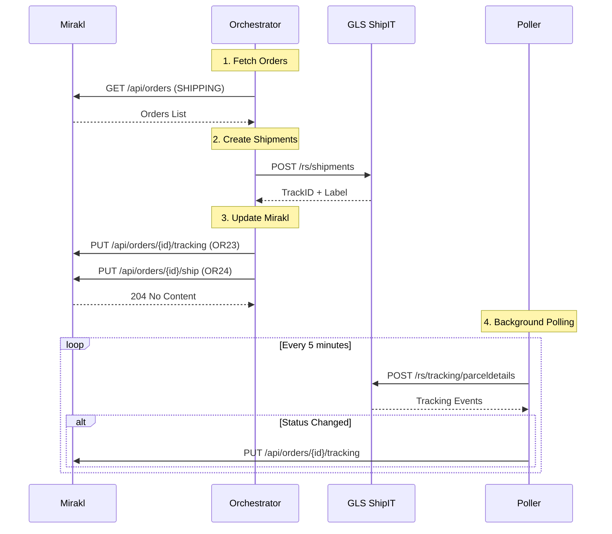

# GLS ShipIT Integration Guide

## Descripción General

Este documento describe la integración completa del carrier GLS ShipIT con el orquestador Mirakl-Carrier.

La integración permite:
- ✅ Crear envíos en GLS desde pedidos de Mirakl
- ✅ Obtener etiquetas (PDF/ZPL) y TrackID
- ✅ Actualizar Mirakl con tracking (OR23) y marcar como enviado (OR24)
- ✅ Consultar estado de tracking
- ✅ Polling automático de tracking para detectar cambios
- ✅ Webhook endpoint para agregadores de tracking (AfterShip/TrackingMore)

---

## Arquitectura

### Componentes

1. **GlsAdapter** (`backend/app/adapters/carriers/gls.py`)
   - Implementa la interfaz CarrierAdapter
   - Conecta con GLS ShipIT REST API v1
   - Soporta modo mock y modo real

2. **GlsTrackingPoller** (`backend/app/services/gls_tracking_poller.py`)
   - Servicio de polling para tracking
   - Consulta periódicamente el estado de envíos activos
   - Actualiza Mirakl automáticamente cuando detecta cambios

3. **Orchestrator Endpoints** (`backend/app/api/orchestrator.py`)
   - `/api/v1/orchestrator/mirakl-to-gls` - Flujo completo Mirakl → GLS → Mirakl
   - `/api/v1/orchestrator/test-gls-direct` - Test directo de GLS
   - `/api/v1/orchestrator/gls/tracking-poller/*` - Control del poller
   - `/api/v1/orchestrator/gls/webhook/tracking-update` - Webhook para agregadores

---

## GLS ShipIT API Endpoints Implementados

### Shipments

| Endpoint | Método | Implementado | Descripción |
|----------|--------|--------------|-------------|
| `/rs/shipments` | POST | ✅ | Crear envío y obtener etiqueta |
| `/rs/shipments/validate` | POST | ✅ | Validar envío antes de crear |
| `/rs/shipments/cancel/{trackID}` | POST | ✅ | Cancelar envío |
| `/rs/shipments/allowedservices` | POST | ✅ | Obtener servicios permitidos |
| `/rs/shipments/endofday` | POST | ✅ | Ejecutar cierre de día |
| `/rs/shipments/reprintparcel` | POST | ⚠️ | Reimprimir etiqueta (preparado) |

### Tracking

| Endpoint | Método | Implementado | Descripción |
|----------|--------|--------------|-------------|
| `/rs/tracking/parceldetails` | POST | ✅ | Detalles completos de tracking |
| `/rs/tracking/parcels` | POST | ✅ | Buscar paquetes por referencia |
| `/rs/tracking/parcelpod` | POST | ⚠️ | Proof of Delivery (preparado) |

**Leyenda:** ✅ Implementado | ⚠️ Preparado pero no usado en MVP | ❌ No implementado

---

## Configuración

### Variables de Entorno

Añadir al archivo `.env`:

```bash
# GLS ShipIT Configuration
GLS_BASE_URL=https://api.gls-group.net/shipit-farm/v1/backend
GLS_USERNAME=tu_usuario
GLS_PASSWORD=tu_password
GLS_CONTACT_ID=tu_contact_id
GLS_LABEL_FORMAT=PDF
GLS_TEMPLATE_SET=NONE
GLS_MOCK_MODE=true  # false para producción
GLS_REQUESTER=optional_requester_header
```

### Configuración en settings.py

El adapter lee la configuración de `backend/app/core/settings.py`:

```python
class Settings(BaseSettings):
    # ... otras configuraciones ...
    
    # GLS ShipIT
    gls_base_url: str = "https://api.gls-group.net/shipit-farm/v1/backend"
    gls_username: str = ""
    gls_password: str = ""
    gls_contact_id: str = ""
    gls_label_format: str = "PDF"
    gls_template_set: str = "NONE"
    gls_mock_mode: bool = True
    gls_requester: Optional[str] = None
```

---

## Uso del API

### 1. Flujo Completo: Mirakl → GLS → Actualizar Mirakl

**Endpoint:** `POST /api/v1/orchestrator/mirakl-to-gls`

Este endpoint ejecuta el flujo completo del MVP:
1. Obtiene pedidos de Mirakl (estado SHIPPING)
2. Transforma los pedidos al formato GLS
3. Crea envíos en GLS (obtiene TrackID y etiqueta)
4. Actualiza Mirakl con tracking (OR23)
5. Marca pedido como enviado en Mirakl (OR24)

**Request:**
```bash
curl -X POST "http://localhost:8000/api/v1/orchestrator/mirakl-to-gls?limit=10" \
  -H "Authorization: Bearer YOUR_JWT_TOKEN"
```

**Response:**
```json
{
  "success": true,
  "message": "Procesadas 5 órdenes de Mirakl; creados 5 envíos en GLS; 5 actualizaciones a Mirakl",
  "orders_processed": 5,
  "shipments_created": 5,
  "mirakl_updates": [
    {
      "order_id": "70268248-A",
      "tracking_number": "GLS1234567",
      "status": "updated",
      "mirakl_response": {...}
    }
  ],
  "shipments": [
    {
      "shipment_id": "GLS1234567",
      "track_id": "GLS1234567",
      "status": "CREATED",
      "carrier": "gls",
      "service": "PARCEL",
      "label": {
        "format": "PDF",
        "bytes_b64": "JVBERi0xLjQK..."
      }
    }
  ],
  "duration_ms": 1250
}
```

### 2. Test Directo de GLS

**Endpoint:** `POST /api/v1/orchestrator/test-gls-direct`

Prueba la conectividad con GLS usando datos hardcodeados.

**Request:**
```bash
curl -X POST "http://localhost:8000/api/v1/orchestrator/test-gls-direct" \
  -H "Authorization: Bearer YOUR_JWT_TOKEN"
```

### 3. Consultar Tracking de un Envío

El tracking se consulta automáticamente por el poller, pero también puedes consultarlo manualmente:

```python
from backend.app.adapters.carriers.gls import GlsAdapter

gls = GlsAdapter()
tracking = await gls.get_shipment_status("GLS1234567")

print(tracking)
# {
#   "shipment_id": "GLS1234567",
#   "status": "IN_TRANSIT",
#   "events": [
#     {
#       "date": "2025-01-15T10:30:00Z",
#       "status_code": "TRANSIT",
#       "description": "Parcel in transit",
#       "location": "Madrid Hub",
#       "country": "ES"
#     }
#   ]
# }
```

---

## Tracking Poller

El poller consulta periódicamente el estado de envíos GLS activos y actualiza Mirakl automáticamente.

### Iniciar el Poller

**Endpoint:** `POST /api/v1/orchestrator/gls/tracking-poller/start`

```bash
curl -X POST "http://localhost:8000/api/v1/orchestrator/gls/tracking-poller/start" \
  -H "Authorization: Bearer YOUR_JWT_TOKEN"
```

**Response:**
```json
{
  "success": true,
  "message": "GLS tracking poller started",
  "poll_interval_seconds": 300,
  "status": "running"
}
```

### Detener el Poller

**Endpoint:** `POST /api/v1/orchestrator/gls/tracking-poller/stop`

```bash
curl -X POST "http://localhost:8000/api/v1/orchestrator/gls/tracking-poller/stop" \
  -H "Authorization: Bearer YOUR_JWT_TOKEN"
```

### Consultar Estado del Poller

**Endpoint:** `GET /api/v1/orchestrator/gls/tracking-poller/status`

```bash
curl "http://localhost:8000/api/v1/orchestrator/gls/tracking-poller/status" \
  -H "Authorization: Bearer YOUR_JWT_TOKEN"
```

### Ejecutar Polling Manualmente (Una Vez)

**Endpoint:** `POST /api/v1/orchestrator/gls/tracking-poller/poll-once`

```bash
curl -X POST "http://localhost:8000/api/v1/orchestrator/gls/tracking-poller/poll-once" \
  -H "Authorization: Bearer YOUR_JWT_TOKEN"
```

### Consultar Tracking de una Orden Específica

**Endpoint:** `POST /api/v1/orchestrator/gls/tracking-poller/poll-order/{order_id}`

```bash
curl -X POST "http://localhost:8000/api/v1/orchestrator/gls/tracking-poller/poll-order/70268248-A" \
  -H "Authorization: Bearer YOUR_JWT_TOKEN"
```

---

## Webhook para Agregadores de Tracking

El endpoint webhook está preparado para integrarse con servicios de tracking de terceros como AfterShip o TrackingMore, que sí ofrecen webhooks push para GLS.

### Configurar Webhook en AfterShip/TrackingMore

1. En tu cuenta de AfterShip/TrackingMore, configura un webhook hacia:
   ```
   https://tu-dominio.com/api/v1/orchestrator/gls/webhook/tracking-update
   ```

2. El agregador enviará actualizaciones de tracking automáticamente.

### Formato del Webhook

**Endpoint:** `POST /api/v1/orchestrator/gls/webhook/tracking-update`

**Request Body:**
```json
{
  "tracking_number": "GLS1234567",
  "status": "DELIVERED",
  "order_reference": "70268248-A",
  "events": [
    {
      "date": "2025-01-15T14:30:00Z",
      "status_code": "DELIVERED",
      "description": "Package delivered",
      "location": "Madrid",
      "country": "ES"
    }
  ]
}
```

**Response:**
```json
{
  "success": true,
  "message": "Tracking update processed",
  "order_id": "70268248-A",
  "tracking_number": "GLS1234567",
  "status": "DELIVERED"
}
```

---

## Mapeo de Estados GLS

El adapter normaliza los estados de GLS a estados estándar:

| Estado GLS | Estado Normalizado |
|------------|-------------------|
| Contains "DELIVER" | DELIVERED |
| Contains "OUT" or "DELIVERY" | OUT_FOR_DELIVERY |
| Contains "TRANSIT" or "HUB" | IN_TRANSIT |
| Contains "PICKUP" or "COLLECT" | PICKED_UP |
| Otros | IN_TRANSIT |

---

## Datos de Prueba (Mock Mode)

Cuando `GLS_MOCK_MODE=true`, el adapter retorna datos simulados sin conectar con GLS:

```json
{
  "shipment_id": "GLS1234567",
  "track_id": "GLS1234567",
  "status": "CREATED",
  "estimated_delivery": "2025-01-17T10:00:00Z",
  "cost": 19.90,
  "currency": "EUR",
  "carrier": "gls",
  "service": "PARCEL",
  "label": {
    "format": "PDF",
    "bytes_b64": "R0xTIE1PQ0sgTEFCRUwKVHJhY2tJRDogR0xTMTIzNDU2Nwo="
  }
}
```

---

## Flujo End-to-End Completo



---

## Testing

### 1. Test Unitario del Adapter

```python
import pytest
from backend.app.adapters.carriers.gls import GlsAdapter

@pytest.mark.asyncio
async def test_create_shipment_mock():
    adapter = GlsAdapter()
    adapter.mock_mode = True
    
    order_data = {
        "order_id": "TEST-001",
        "customer_name": "Test Customer",
        "weight": 2.5,
        "shipping_address": {
            "name": "Test Customer",
            "address1": "Calle Test 123",
            "city": "Madrid",
            "postal_code": "28001",
            "country": "ES"
        }
    }
    
    result = await adapter.create_shipment(order_data)
    
    assert result["status"] == "CREATED"
    assert "track_id" in result
    assert "label" in result
```

### 2. Test del Flujo Completo

```bash
# 1. Iniciar el backend
cd backend
uvicorn app.main:app --reload

# 2. Obtener token JWT
curl -X POST "http://localhost:8000/api/v1/auth/login" \
  -H "Content-Type: application/json" \
  -d '{"username":"admin","password":"admin"}'

# 3. Ejecutar flujo Mirakl → GLS
curl -X POST "http://localhost:8000/api/v1/orchestrator/mirakl-to-gls?limit=5" \
  -H "Authorization: Bearer YOUR_TOKEN"

# 4. Iniciar poller
curl -X POST "http://localhost:8000/api/v1/orchestrator/gls/tracking-poller/start" \
  -H "Authorization: Bearer YOUR_TOKEN"

# 5. Verificar estado del poller
curl "http://localhost:8000/api/v1/orchestrator/gls/tracking-poller/status" \
  -H "Authorization: Bearer YOUR_TOKEN"

# 6. Polling manual
curl -X POST "http://localhost:8000/api/v1/orchestrator/gls/tracking-poller/poll-once" \
  -H "Authorization: Bearer YOUR_TOKEN"
```

---

## Troubleshooting

### Error: "GLS tracking API no integrada todavía"

- ✅ **Resuelto:** El tracking está completamente implementado ahora.

### Error: "Missing required fields: tracking_number, status"

- Verificar que el webhook incluye `tracking_number` y `status`.

### Polling No Detecta Cambios

- Verificar que las órdenes están en `unified_order_logger` con `carrier_code: "gls"`.
- Verificar que tienen `tracking_number`.
- Revisar logs: `backend/logs/operations.csv`.

### Etiqueta No Se Genera

- Verificar que `ReturnLabels` está habilitado en `PrintingOptions`.
- Verificar que `GLS_LABEL_FORMAT` está configurado (`PDF` o `ZEBRA`).
- En mock mode, siempre se genera una etiqueta base64.

---

## Próximos Pasos

### Implementaciones Futuras (Post-MVP)

1. **OAuth 2.0 Authentication**
   - Actualmente usa Basic Auth
   - El spec define OAuth2 con client credentials flow
   - URL: `https://api.gls-group.net/oauth2/v2/token`

2. **Servicios Adicionales**
   - FlexDelivery (2C)
   - Cash on Delivery (reembolso)
   - ShopDelivery (ParcelShop)
   - Ident/IdentPIN

3. **Proof of Delivery (POD)**
   - Endpoint: `/rs/tracking/parcelpod`
   - Retorna imagen de firma del receptor

4. **Reimpresión de Etiquetas**
   - Endpoint: `/rs/shipments/reprintparcel`
   - Útil si se pierde la etiqueta original

5. **Integración con Agregadores de Tracking**
   - AfterShip: https://www.aftership.com/
   - TrackingMore: https://www.trackingmore.com/
   - Configurar webhooks push reales

---

## Referencias

- [GLS ShipIT API Documentation](https://shipit-download.gls-group.eu/documentation/)
- OpenAPI Spec: `docs/gls-shipit-farm.yaml`
- Adapter Implementation: `backend/app/adapters/carriers/gls.py`
- Tracking Poller: `backend/app/services/gls_tracking_poller.py`
- Orchestrator Endpoints: `backend/app/api/orchestrator.py`

---

## Contacto y Soporte

Para problemas o preguntas sobre esta integración:
- Revisar logs en `backend/logs/operations.csv`
- Consultar documentación de GLS ShipIT
- Verificar configuración en `.env`

**Última Actualización:** 2025-01-15

